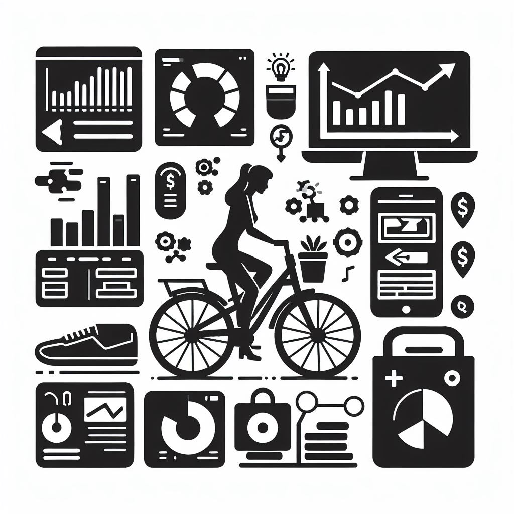

# Projects

### Project 1: Credit Granting ML

- **Description:** Leverages Decision Tree algorithm for credit assessment.
- **Skills Used:** List of skills used (e.g., Python, SQL, Data Visualization).

  
  
  [Credit Granting ML Notebook Link](https://pedroscala.github.io/cgc_site/)

### Project 2: Spam Detection Model

- **Description:** Utilizes Naive Bayes algorithm for spam identification.
- **Skills Used:** List of skills used (e.g., R, Data Cleaning, Machine Learning).
  
  
  
- [(Spam Detection Notebook Link)](https://pedroscala.github.io/cgc_site/)

### Project 3: Movie Recomender

- **Description:** Discover personalized movie suggestions with our Movie Recommender.
This intelligent tool analyzes your preferences and viewing history, delivering tailored recommendations to elevate your movie-watching experience.
- **Skills Used:** Python (Pandas, Seaborn, Sklearn, SVD)
 
  
- [(Movie Recomender Notebook Link)](https://pedroscala.github.io/rec_algo_netflix/)

### Project 4: Sales Management Dashboard

- **Description:** Address business and customer needs defined by the Sales Manager.
- **Tools Used:** Excel, SQL and Power BI.
 
  
- [(Sales Management Dev. Description)](https://pedroscala.github.io/Projeto-de-Gerenciamento-de-Vendas-AW/))

## Professional Experience

### HEINEKEN Co.
*September 2022 - Present*
- Applied time series prediction techniques to forecast free operating cashflow and P&L statements, with a specific focus on fixed expenses. Successfully reduced the monthly error in the rolling forecast by $30 million.
- Leveraged Python to connect with the Marine Traffic API, enhancing shipments control. Provided accurate forecasts of cargo ETA, generating proactive alerts in Outlook and MS Teams for Supply Chain squads. This initiative helped mitigate warehousing additional costs.
- Implemented complex tax incentives calculations, resulting in 1500 hours of automated work and a $1 million monthly gain. This was achieved by enhancing calculation granularity, contributing to increased financial efficiency.
- Spearheaded the construction and maintenance of dynamic dashboards, offering real-time monitoring of financial key indicators. This strategic visualization facilitated swift decision-making processes and contributed to overall financial transparency.

### Kroton Educational 
*September 2021 - August 2022*
- Supported decision-making by providing managers and VP of Operations with reports and dashboards in Power BI. Analysis of opportunities using financial, operational, commercial, and academic data.
- Developed sophisticated time series models using Python and PyCaret to predict student enrollments across 2000 educational facilities. This initiative facilitated proactive resource allocation and optimization.
- Projection, development, and testing of data pipelines, source mapping, and data movement of 40+ datasets. Ensuring high-quality data for product decision-making and contributing to the creation of robust data-driven product strategies.
- Delivered engaging presentations and user training on data solutions, enhancing data literacy across the sector and facilitating informed decision-making.

### Urban Dog E-commerce
*July 2019 - August 2021*
- Developed and maintained dashboards in Power BI, focusing on KPIs related to product sales, inventory management, and customer behavior.
- Executed SQL queries and utilized Excel, Microsoft SQL Server, R, and Python for data extraction, manipulation, and interpretation, facilitating informed decision-making.
- Applied statistical techniques to optimize operational and financial indicators, contributing to data-driven product development and improved performance.

## Education
- **MBA USP/ESALQ: Data Science & Analytics** -  
  *2020 - 2022
*Course Modules:*
    1. Supervised and Unsupervised Machine Learning Models
    2. Trends in Data Science and Analytics
    3. Data Science and Big Data in the Business Environment

- **ILAC International College** -  
  *2017 - 2018  
  *Diploma:* Service Excellence For Business 
  
- **Industrial Engineering College** -  
  *2012 - 2016  
  *Degree:* Bachelor in Chemical Engineering

## Skills

- Python
- SQL
- Power BI
- Spark
- R
- Statistical Modeling
- Data Visualization (Matplotlib, Searborn)

## Contact Information

- **LinkedIn:** [LinkedIn Profile]
- **GitHub:** [GitHub Profile]
