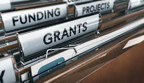

# Data Analyst Portfolio

## About Me

I am a dedicated Data Analyst with a passion for translating information into valuable insights that drive business success. Holding a degree in Chemical Engineering from FEI and an MBA in Data Science & Analytics from USP/ESALQ, I bring over four years of experience in handling data for companies of diverse scales. My journey into data analysis began as a researcher during scientific initiation, where I recognized the significance of computational methods and scientific methodologies in effective problem-solving.

To further enrich my knowledge and business acumen, I spent a transformative year in Toronto. Currently, I serve as a Financial Data Analyst in the beverage production industry. My curiosity is a driving force, and I actively seek new challenges to exercise and enhance my analytical skills. My interests span across various domains, including Data Analytics, Data Science, Descriptive Statistics, Machine Learning, Visualization and Dashboard Design, SQL, Python, Spark, R, and Power BI.

Constantly on the lookout for opportunities to refine my skills, I am committed to applying my expertise to tackle complex projects and contribute to the success of any team or organization.

## Projects

### Project 1: [Project Name 1]

- **Description:** Brief description of the project.
- **Skills Used:** List of skills used (e.g., Python, SQL, Data Visualization).
- 
- [Link to Project 1][(https://project1-link.com)](https://pedroscala.github.io/cgc_site/)

### Project 2: [Project Name 2]

- **Description:** Brief description of the project.
- **Skills Used:** List of skills used (e.g., R, Data Cleaning, Machine Learning).
- 
- [Link to Project 2](https://project2-link.com)

### Project 3: [Project Name 3]

- **Description:** Brief description of the project.
- **Skills Used:** List of skills used (e.g., Excel, Statistical Analysis).
- 
- [Link to Project 3](https://project3-link.com)

### Project 4: [Project Name 4]

- **Description:** Brief description of the project.
- **Skills Used:** List of skills used (e.g., Pandas, Data Visualization).
- 
- [Link to Project 4](https://project4-link.com)

### Project 5: [Project Name 5]

- **Description:** Brief description of the project.
- **Skills Used:** List of skills used (e.g., Tableau, Predictive Modeling).
- 
- [Link to Project 5](https://project5-link.com)

## Education

- **MBA USP/ESALQ: Data Science & Analytics**
  - *Start:* July 2022
  - *Modules:*
    1. Supervised and Unsupervised Machine Learning Models
    2. Trends in Data Science and Analytics
    3. Data Science and Big Data in the Business Environment

- **Industrial Engineering College**
  - *Duration:* 2012 - 2016
  - *Degree:* Bachelor in Chemical Engineering

## Skills

- Python
- SQL
- Power BI
- Spark
- R
- Statistical Modeling
- Data Visualization (Matplotlib, Searborn)

## Contact Information

- **LinkedIn:** [LinkedIn Profile]
- **GitHub:** [GitHub Profile]
